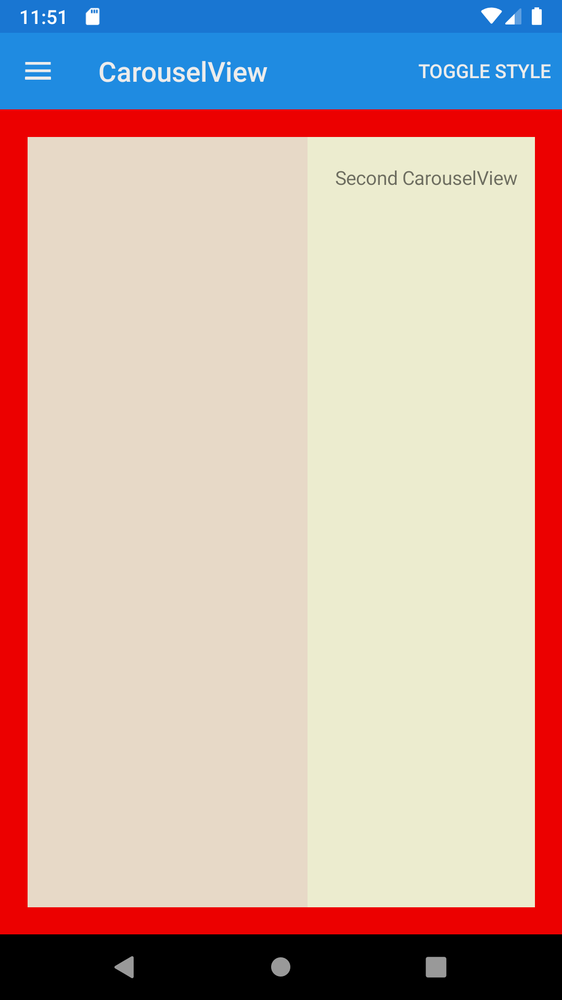





CarouselView
--------

##### `topic last updated: v1.0 - 24.04.2021 - 11:47pm`

### [back to interface objects](view-interface-objects.html#interface-objects)

<br />

displays a scrollable list of data 

<br /> 

### Basic example


```fsharp 
CarouselView([
    Label("First CarouselView")
    Label("Second CarouselView")
    Label("Third CarouselView")
] )
```


<br /> <br /> 

### Basic example with styling

```fsharp 
CarouselView([
    Label("First CarouselView")
        .horizontalOptions(style.Position)
        .verticalOptions(style.Position)
        .backgroundColor(style.ViewColor)
        .padding(style.Padding) 
    
    Label("Second CarouselView")
        .horizontalOptions(style.Position)
        .verticalOptions(style.Position)
        .backgroundColor(style.ViewColor2)
        .padding(style.Padding)  
        
    Label("Third CarouselView")
        .horizontalOptions(style.Position)
        .verticalOptions(style.Position)
        .backgroundColor(style.ViewColor3)
        .padding(style.Padding) 
        ] 
    )
        .horizontalOptions(style.Position),
        .verticalOptions(style.Position),
        .backgroundColor(style.LayoutColor),
```




<br /> <br /> 

See also:

* [CarouselView in Xamarin Forms](https://docs.microsoft.com/en-us/xamarin/xamarin-forms/user-interface/CarouselView)
* [`Xamarin.Forms.CarouselView`](https://docs.microsoft.com/en-us/dotnet/api/xamarin.forms.carouselview?view=xamarin-forms)
