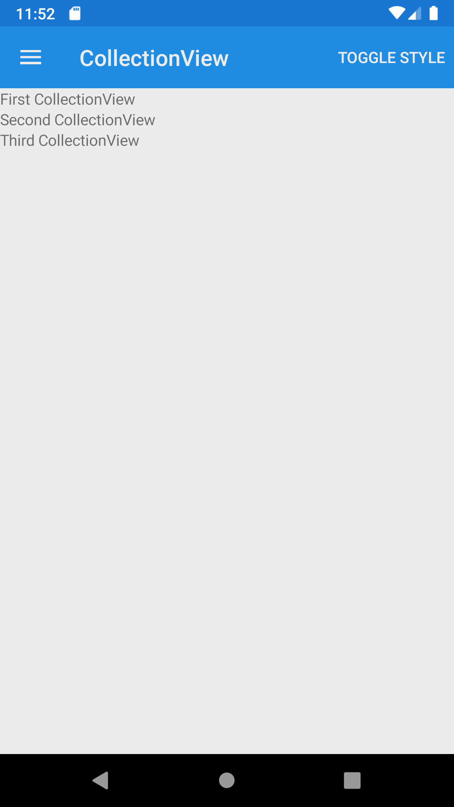
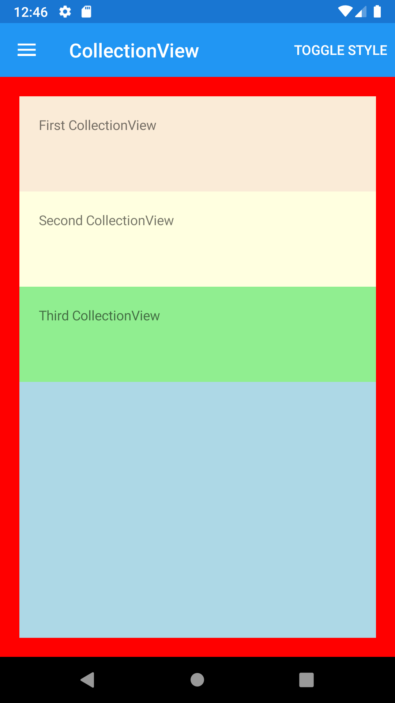





CollectionView
--------
##### `topic last updated: v1.0 - 24.04.2021 - 11:47pm`

### [back to interface objects](view-interface-objects.html#interface-objects)

<br />

displays a scrollable list of selectable data items, using different layout specifications

Please read the Xamarin.Forms documentation to check whether this control is available for the platforms you target.

<br /> 

### Basic example


```fsharp 
CollectionView([
    Label("First CollectionView")
    Label("Second CollectionView")
    Label("Third CollectionView")
] )
```



<br /> <br /> 

### Basic example with styling

```fsharp 
CollectionView([
    Label("First CollectionView")
        .horizontalOptions(style.Position),
        .verticalOptions(style.Position),
        .backgroundColor(style.ViewColor),
        .padding(style.Padding)
    
    Label("Second CollectionView")
        .horizontalOptions(style.Position),
        .verticalOptions(style.Position),
        .backgroundColor(style.ViewColor3),
        .padding(style.Padding)
    
    Label("Third CollectionView")
        .horizontalOptions(style.Position),
        .verticalOptions(style.Position),
        .backgroundColor(style.ViewColor3),
        .padding(style.Padding) 
    ] )
        .horizontalOptions(style.Position),
        .verticalOptions(style.Position),
        .backgroundColor(style.LayoutColor),
```



<br /> <br /> 

See also:

* [CollectionView in Xamarin Forms](https://docs.microsoft.com/en-us/xamarin/xamarin-forms/user-interface/CollectionView)
* [`Xamarin.Forms.CollectionView`](https://docs.microsoft.com/en-us/dotnet/api/Xamarin.Forms.CollectionView)


### More examples


