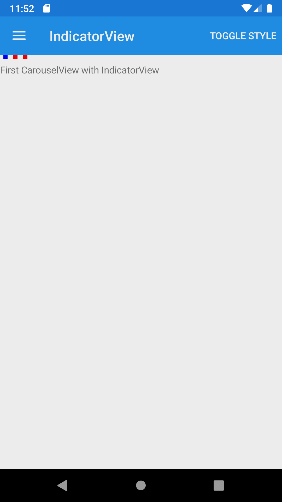
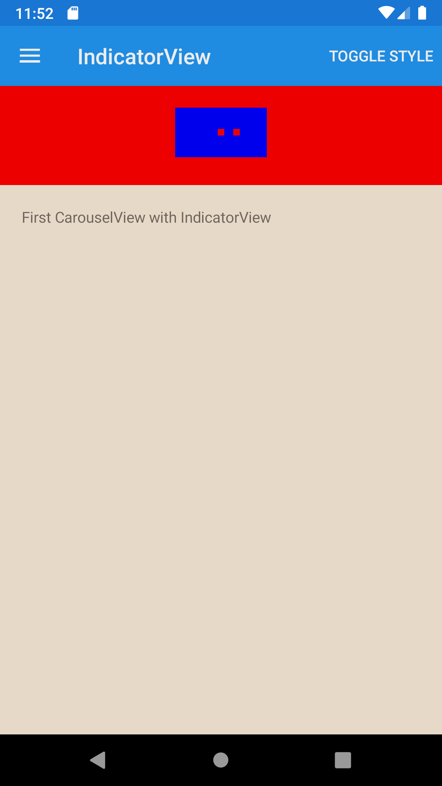





IndicatorView
--------
##### `topic last updated: v1.0 - 24.04.2021 - 11:47pm`

### [back to interface objects](view-interface-objects.html#interface-objects)

<br />

displays indicators that represent the number of items in a CarouselView

<br /> 

### Basic example


```fsharp 
VerticalStackLayout([
    IndicatorView(ref = indicatorRef)
        .indicatorColor(Color.Red)
        .selectedIndicatorColor(Color.Blue)
        .indicatorsShape(IndicatorShape.Square)                
    CarouselView(items = [ 
        Label("First CarouselView with IndicatorView")
        Label("Second CarouselView with IndicatorView")
        Label("Third CarouselView with IndicatorView")
    ] )
] )
```



<br /> <br /> 

### Basic example with styling

```fsharp 
VerticalStackLayout([
    IndicatorView(ref = indicatorRef)
        .horizontalOptions(style.Position,)
        .verticalOptions(style.Position,)
        .backgroundColor(style.LayoutColor,)
        .padding(style.Padding,)
        .indicatorColor(Color.Red) 
        .selectedIndicatorColor(Color.Blue,) 
        .indicatorsShape(IndicatorShape.Square)
                     
    CarouselView(
        indicatorView = indicatorRef,
        [
            Label("First CarouselView with IndicatorView")
                .horizontalOptions(style.Position),
                .verticalOptions(style.Position),
                .backgroundColor(style.ViewColor),
                .padding(style.Padding)
    
            Label("Second CarouselView with IndicatorView")
                .horizontalOptions(style.Position),
                .verticalOptions(style.Position),
                .backgroundColor(style.ViewColor3),
                .padding(style.Padding)
    
            Label("Third CarouselView with IndicatorView")
                .horizontalOptions(style.Position),
                .verticalOptions(style.Position),
                .backgroundColor(style.ViewColor3),
                .padding(style.Padding)
        ]    
    )
] )
```



<br /> <br /> 

See also:

* [IndicatorView in Xamarin Forms](https://docs.microsoft.com/en-us/xamarin/xamarin-forms/user-interface/IndicatorView)
* [`Xamarin.Forms.IndicatorView`](https://docs.microsoft.com/en-us/dotnet/api/Xamarin.Forms.IndicatorView)
