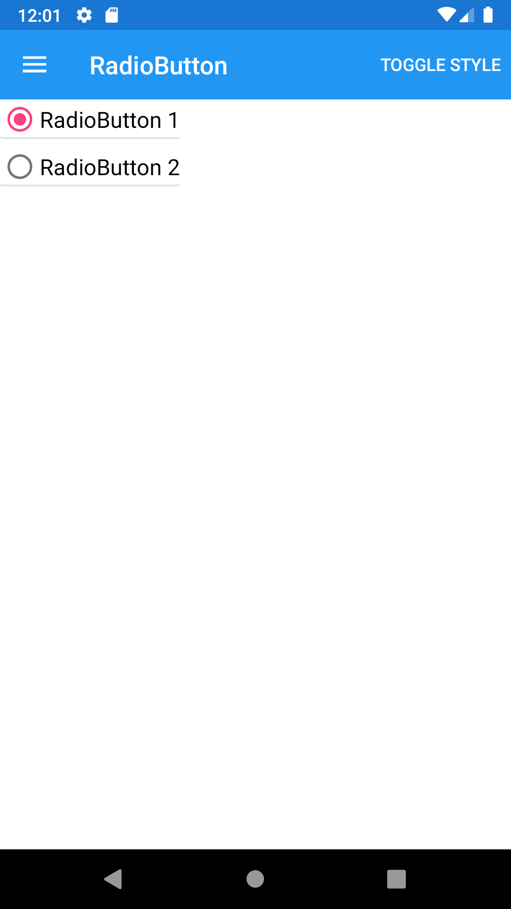
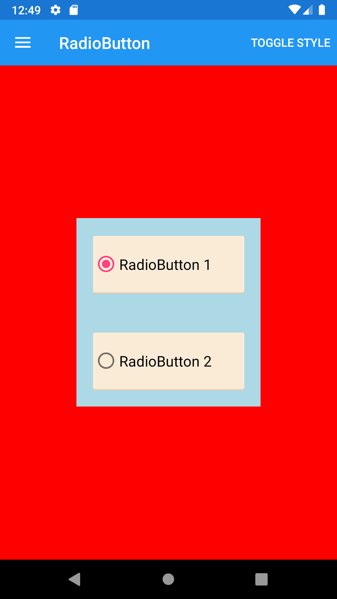





RadioButton
--------
##### `topic last updated: v1.0 - 24.04.2021 - 11:47pm`

### [back to interface objects](view-interface-objects.html#interface-objects)

<br />

### Basic example


```fsharp 
VerticalStackLayout([
    View.RadioButton("RadioButton 1")
     View.RadioButton("RadioButton 2")
 ])
```



<br /> <br /> 

### Basic example with styling

```fsharp 
VerticalStackLayout([                                
    RadioButton(true, "RadioButton 1")
        .horizontalOptions(style.Position)
        .verticalOptions(style.Position)
        .backgroundColor(style.ViewColor)
        .padding(style.Padding)
    RadioButton(false, "RadioButton 2")
        .horizontalOptions(style.Position)
        .verticalOptions(style.Position)
        .backgroundColor(style.ViewColor)
        .padding(style.Padding)
    ]).horizontalOptions(style.Position)
      .verticalOptions(style.Position)
      .backgroundColor(style.LayoutColor)
```



<br /> <br /> 

See also:

* [RadioButton in Xamarin Forms](https://docs.microsoft.com/en-us/xamarin/xamarin-forms/user-interface/RadioButton)
* [`Xamarin.Forms.RadioButton`](https://docs.microsoft.com/en-us/dotnet/api/Xamarin.Forms.RadioButton)

<br /> 

### More examples

```fsharp 
VerticalStackLayout([
    // These RadioButtons will be grouped togehter, beacause they are in the same StackLayout
    RadioButton(
        padding = Thickness 2.0,
        content = Content.String("content1"), 
        isChecked = true
        checkedChanged = (fun on -> dispatch (...))
    )
    RadioButton(
        padding = Thickness 2.0,
        content = Content.String("content2"), 
        isChecked = false
        checkedChanged = (fun on -> dispatch (...))
    )
])
```
