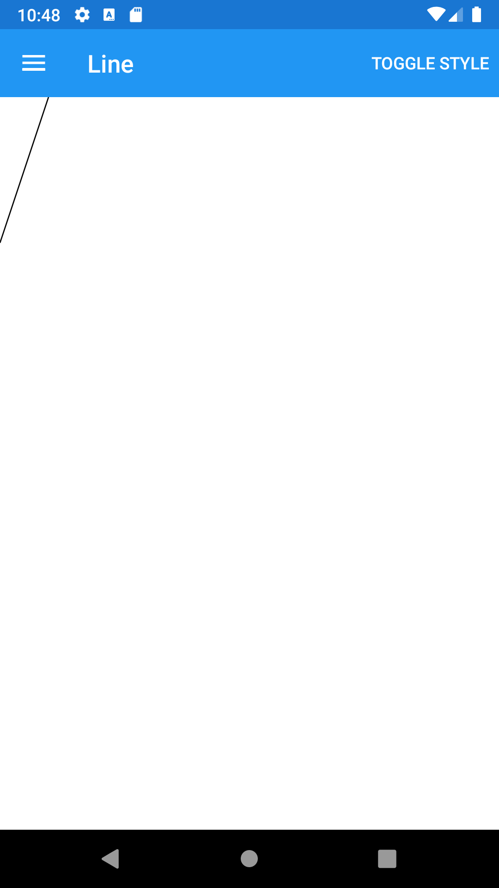
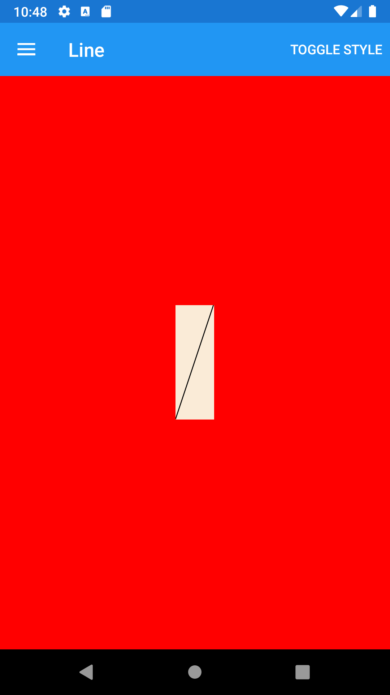





Line
--------
##### `topic last updated: v1.0 - 24.04.2021 - 11:47pm`

### [back to interface objects](view-interface-objects.html#interface-objects)

<br />

### Basic example


```fsharp 
Line
    (
        stroke = SolidColorBrush(Color.Black),
        x1 = 40., 
        y1 = 0., 
        x2 = 0., 
        y2 = 120.
    )
```



<br /> <br /> 

### Basic example with styling

```fsharp 
View.Line
    (
        stroke = View.SolidColorBrush(Color.Black),
        x1 = 40., 
        y1 = 0., 
        x2 = 0., 
        y2 = 120.
    ).horizontalOptions(style.Position)
     .verticalOptions(style.Position)
     .backgroundColor(style.ViewColor)
```



<br /> <br /> 

See also:

* [Line in Xamarin Forms](https://docs.microsoft.com/en-us/xamarin/xamarin-forms/user-interface/shapes/Line)
* [`Xamarin.Forms.Line`](https://docs.microsoft.com/en-us/dotnet/api/xamarin.forms.shapes.line?view=xamarin-forms)

<br /> 

### More examples

`Line` can be used to draw lines.

```fsharp 
Label("Line")
Line(x1 = 40., y1 = 0., x2 = 0., y2 = 120., stroke = SolidColorBrush(Color
Label("Line with stroke")
Line(x1 = 40., y1 = 0., x2 = 0., y2 = 120., stroke = SolidColorBrush(Color.DarkBlue), strokeThickness = 4.)

Label("Dashed line")
Line(x1 = 40., y1 = 0., x2 = 0., y2 = 120., stroke = SolidColorBrush(Color.DarkBlue), strokeDashArray = [ 1.; 1. ], strokeDashOffset = 6.)

Label("LineCap: Flat")
Line(x1 = 0., y1 = 20., x2 = 300., y2 = 20., stroke = SolidColorBrush(Color.Red), strokeThickness = 12., strokeLineCap = Shapes.PenLineCap.Flat)

Label("LineCap: Square")
Line(x1 = 0., y1 = 20., x2 = 300., y2 = 20., stroke = SolidColorBrush(Color.Red), strokeThickness = 12., strokeLineCap = Shapes.PenLineCap.Square)

Label("LineCap: Round")
Line(x1 = 0., y1 = 20., x2 = 300., y2 = 20., stroke = SolidColorBrush(Color.Red), strokeThickness = 12., strokeLineCap = Shapes.PenLineCap.Round)
```
