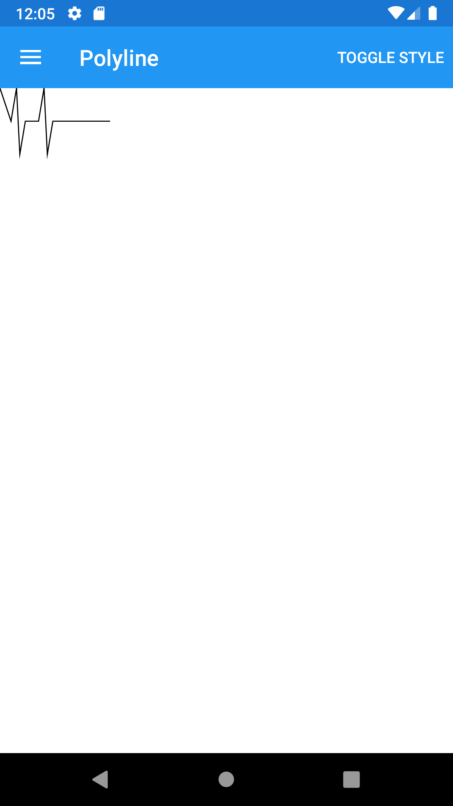
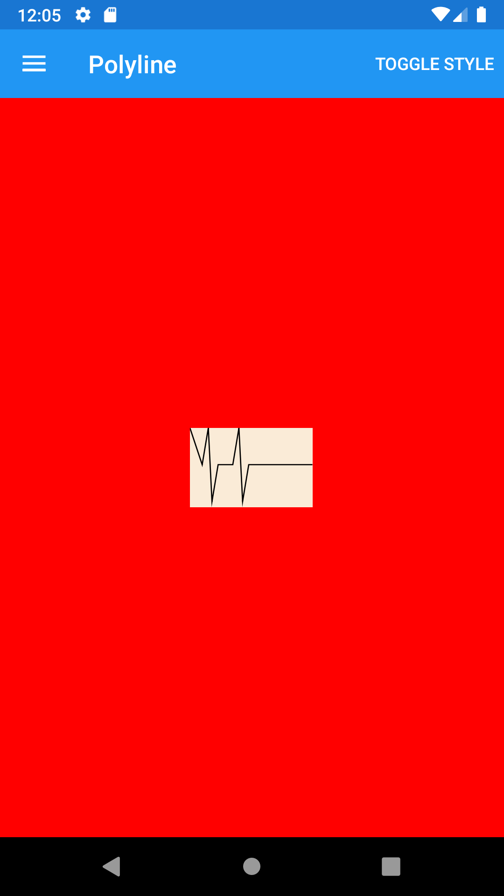





Polyline
--------
##### `topic last updated: v1.0 - 24.04.2021 - 11:47pm`

### [back to interface objects](view-interface-objects.html#interface-objects)

<br />

### Basic example


```fsharp 
Polyline
    (
        points = Points.fromString "0,0 10,30, 15,0 18,60 23,30 35,30 40,0 43,60 48,30 100,30",
        stroke = View.SolidColorBrush(Color.Black),
        strokeThickness = 1.
    )
```



<br /> <br /> 

### Basic example with styling

```fsharp 
Polyline
    (
        points = Points.fromString "0,0 10,30, 15,0 18,60 23,30 35,30 40,0 43,60 48,30 100,30",
        stroke = View.SolidColorBrush(Color.Black),
        strokeThickness = 1.
    ).horizontalOptions(style.Position)
     .verticalOptions(style.Position)
     .backgroundColor(style.ViewColor)
     .margin(style.Thickness)
```




<br /> <br /> 

See also:

* [Polyline in Xamarin Forms](https://docs.microsoft.com/en-us/xamarin/xamarin-forms/user-interface/shapes/Polyline)
* [`Xamarin.Forms.Polyline`](https://docs.microsoft.com/en-us/dotnet/api/xamarin.forms.shapes.polyline?view=xamarin-forms)

<br /> 

### More examples

`Polyline` can be used to draw a series of connected straight lines. A polyline is similar to a polygon, except the last point in a polyline is not connected to the first point. 

```fsharp 
let polylinePoints1 = "0,0 10,30, 15,0 18,60 23,30 35,30 40,0 43,60 48,30 100,30"
let polylinePoints2 = "0 48, 0 144, 96 150, 100 0, 192 0, 192 96, 50 96, 48 192, 150 200 144 48"
let polylinePoints3 = "20 20,250 50,20 120"

Label("Polygon")
Polyline(
    points = Points.fromString polylinePoints1,
    stroke = View.SolidColorBrush(Color.Red),
    strokeThickness = 1.
)

Label("Polyline with dashed stroke")
Polyline(
    points = Points.fromString polylinePoints1,
    stroke = View.SolidColorBrush(Color.Red),
    strokeThickness = 2.,
    strokeDashArray = [ 1.; 1. ],
    strokeDashOffset = 6.
)

Label("EvenOdd polyline")
Polyline(
    points = Points.fromString polylinePoints2,
    fill = View.SolidColorBrush(Color.Blue),
    fillRule = Shapes.FillRule.EvenOdd,
    stroke = View.SolidColorBrush(Color.Red),
    strokeThickness = 3.
)

Label("NonZero polyline")
Polyline(
    points = Points.fromString polylinePoints2,
    fill = View.SolidColorBrush(Color.Black),
    fillRule = Shapes.FillRule.Nonzero,
    stroke = View.SolidColorBrush(Color.Yellow),
    strokeThickness = 3.
)

Label("LineJoin: Miter")
Polyline(
    points = Points.fromString polylinePoints3,
    stroke = View.SolidColorBrush(Color.DarkBlue),
    strokeThickness = 20.,
    strokeLineJoin = Shapes.PenLineJoin.Miter
)

Label("LineJoin: Bevel")
Polyline(
    points = Points.fromString polylinePoints3,
    stroke = View.SolidColorBrush(Color.DarkBlue),
    strokeThickness = 20.,
    strokeLineJoin = Shapes.PenLineJoin.Bevel
)

Label("LineJoin: Round")
Polyline(
    points = Points.fromString polylinePoints3,
    stroke = View.SolidColorBrush(Color.DarkBlue),
    strokeThickness = 20.,
    strokeLineJoin = Shapes.PenLineJoin.Round
)
```
