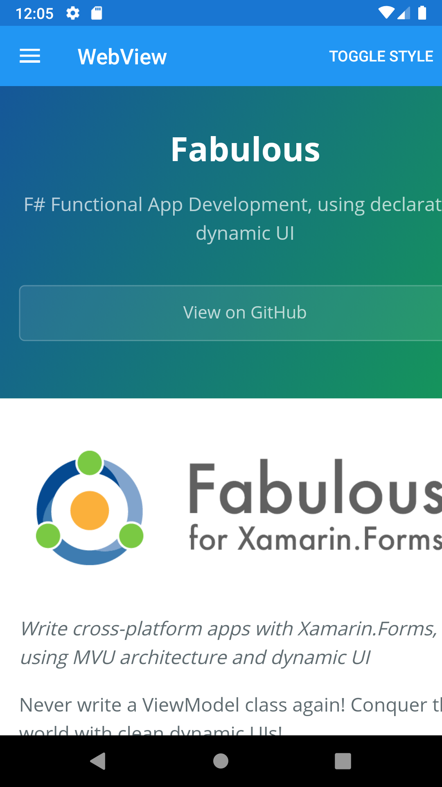





WebView
--------
##### `topic last updated: v1.0 - 24.04.2021 - 11:47pm`

### [back to interface objects](view-interface-objects.html#interface-objects)

<br />

### Basic example

```fsharp 
ContentPage("WebView", WebView("https://fsprojects.github.io/Fabulous/Fabulous.XamarinForms/"))
    .backgroundColor(style.PageColor)
```


<br /> <br /> 

### Basic example with styling

```fsharp
ContentPage(
    "WebView",
    WebView("https://fsprojects.github.io/Fabulous/Fabulous.XamarinForms/")
        .backgroundColor(style.ViewColor)
        .margin(style.Thickness)  
    ).backgroundColor(style.PageColor)
```


<br /> <br /> 

See also:

* [WebView in Xamarin Forms](https://docs.microsoft.com/en-us/xamarin/xamarin-forms/user-interface/WebView)
* [`Xamarin.Forms.WebView`](https://docs.microsoft.com/en-us/dotnet/api/Xamarin.Forms.WebView)

<br /> 

### More examples

`WebView` is a view for displaying web and HTML content in your app:

```fsharp 
let fabulousSite = "https://fsprojects.github.io/Fabulous/Fabulous.XamarinForms/"
WebView(fabulousSite)
    .backgroundColor(style.ViewColor)
    .margin(Thickness(20.)  
```
