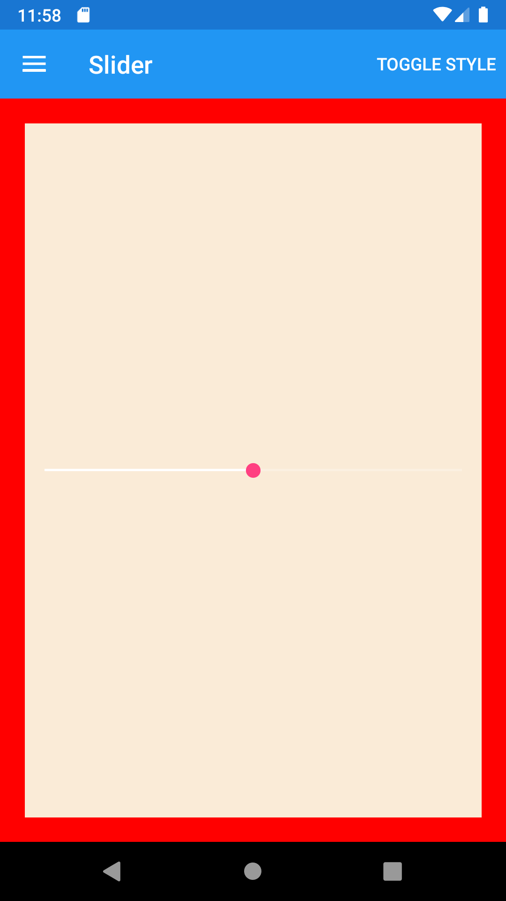





Slider
--------
##### `topic last updated: v1.0 - 24.04.2021 - 11:47pm`

### [back to interface objects](view-interface-objects.html#interface-objects)

<br />

### Basic example


```fsharp 
Slider( 5.0 )
```


<br /> <br /> 

### Basic example with styling

```fsharp 
 Slider(min = 0., max = 10., value = float model.Step)
    .backgroundColor(style.ViewColor)
```




<br /> <br /> 

See also:

* [`Xamarin.Forms.Slider`](https://docs.microsoft.com/en-us/dotnet/api/Xamarin.Forms.Slider)

<br /> 

### More examples

```fsharp
 Slider(min = 0., max = 10., value = float model.Step, onValueChanged = StepChanged)
```


