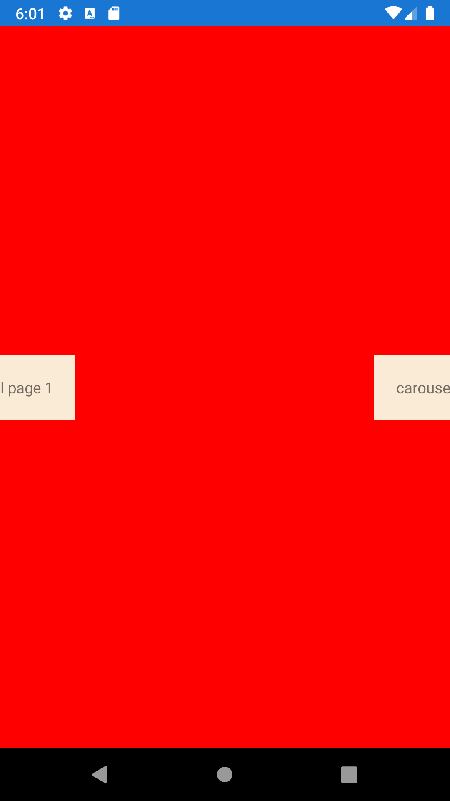





CarouselPage
--------
##### `topic last updated: v1.0 - 24.04.2021 - 11:47pm`

<br />

### Basic example


```fsharp 
CarouselPage([
    ContentPage("carousel1", Label("carousel page 1") )
    ContentPage("carousel1", Label("carousel page 2") )
] )
```

<br /> <br /> 

### Basic example with styling

```fsharp 
CarouselPage(
    "CarouselPage",
    [
        ContentPage(
            "carousel1",
            View.Label("carousel page 1")
                .horizontalOptions(style.Position)
                .verticalOptions(style.Position)
                .backgroundColor(style.ViewColor)
                .padding(style.Padding)
        )                
        ContentPage(
            "carousel1",
            View.Label("carousel page 2")
                .horizontalOptions(style.Position)
                .verticalOptions(style.Position)
                .backgroundColor(style.ViewColor)
                .padding(style.Padding)
        )
    ]
).backgroundColor(style.PageColor)
```


<br /> <br /> 

See also:

* [`Xamarin.Forms.CarouselPage`](https://docs.microsoft.com/en-us/dotnet/api/Xamarin.Forms.CarouselPage)
