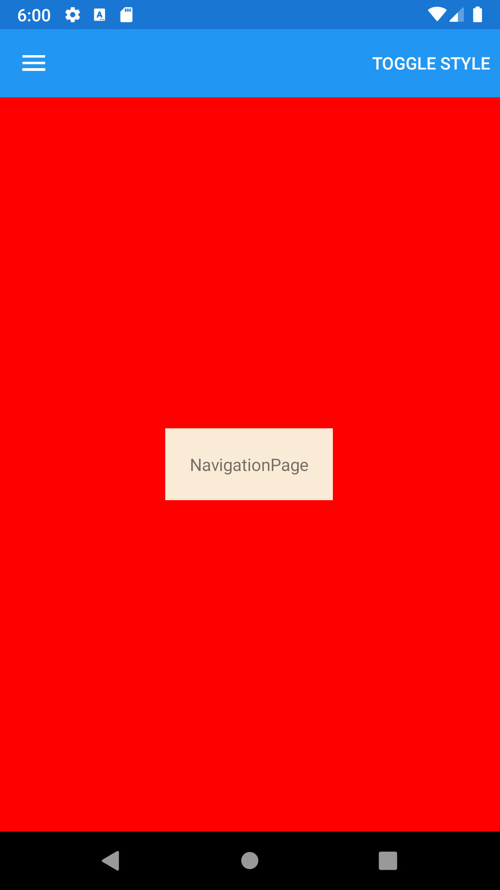





NavigationPage
--------
##### `topic last updated: v1.0 - 24.04.2021 - 11:47pm`

<br /> 

A Page that manages the navigation and user-experience of a stack of other pages.

### Basic example
```fsharp 
NavigationPage([
    ContentPage("ContentPage", Label("NavigationPage with a single Label"))
])
```


<br /> <br /> 

### Basic example with styling
```fsharp 
NavigationPage([
    ContentPage(
        "ContentPage", 
            View.Label("NavigationPage with a single Label")
                .horizontalOptions(style.Position)
                .verticalOptions(style.Position)
                .backgroundColor(style.ViewColor)
                .padding(style.Padding)
        ]
    )
```



<br /> <br /> 

See also:

* [`Xamarin.Forms.NavigationPage`](https://docs.microsoft.com/en-us/dotnet/api/Xamarin.Forms.NavigationPage)
