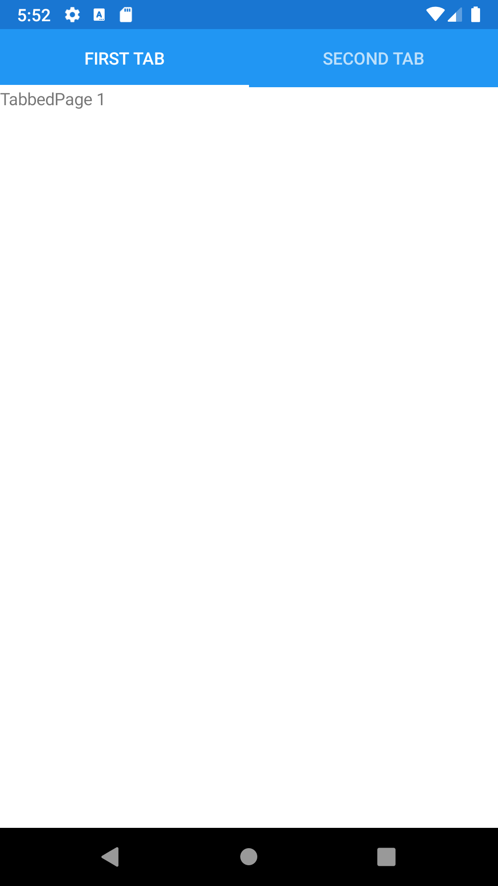
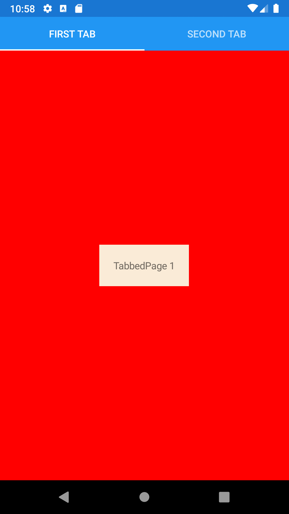





TabbedPage
--------
##### `topic last updated: v1.0 - 24.04.2021 - 11:47pm`

<br /> 
A TabbedPage displays an array of tabs across the top of the screen, each of which loads content onto the screen.

<br /> 
<br /> 

### Basic example
```fsharp       

TabbedPage(
    title,
    [   
        ContentPage("First Tab",  View.Label("TabbedPage 1"))
        ContentPage("Second Tab",  View.Label("TabbedPage 2"))
    ])
```

<br /> 

### Basic example with styling
```fsharp       
TabbedPage(
    "TabbedPage",
    [
        ContentPage(
            "First Tab",
            Label("TabbedPage 1")
                .horizontalOptions(style.Position)
                .verticalOptions(style.Position)
                .backgroundColor(style.ViewColor)
                .padding(style.Padding)
        )
        ContentPage(
            "Second Tab",
            Label("TabbedPage 2")
                .horizontalOptions(style.Position)
                .verticalOptions(style.Position)
                .backgroundColor(style.ViewColor)
                .padding(style.Padding)
        )
    )                
] ).backgroundColor(style.PageColor)
```



<br />

See also:

* [`Xamarin.Forms.TabbedPage`](https://docs.microsoft.com/en-us/dotnet/api/Xamarin.Forms.TabbedPage)
